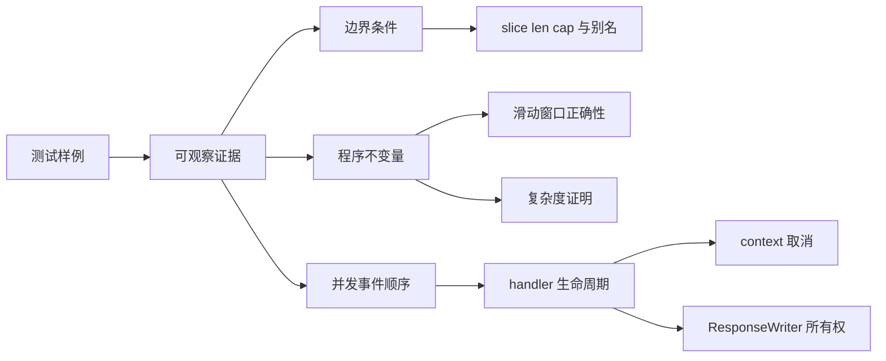
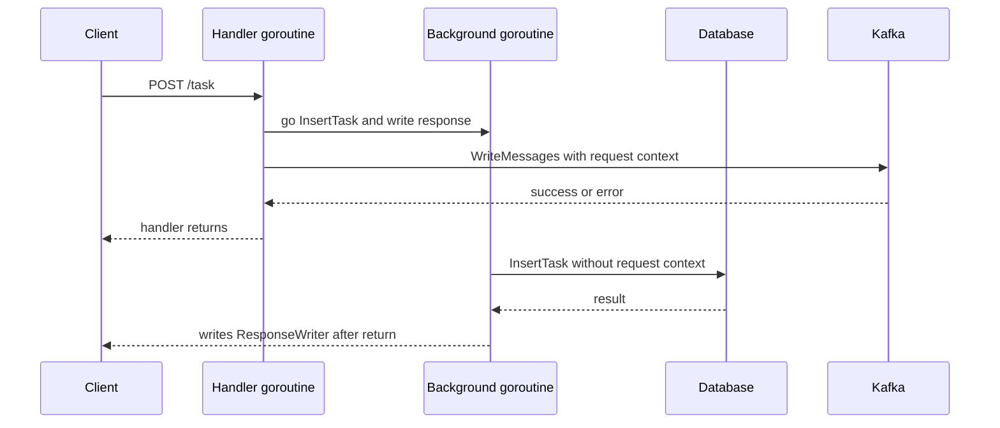
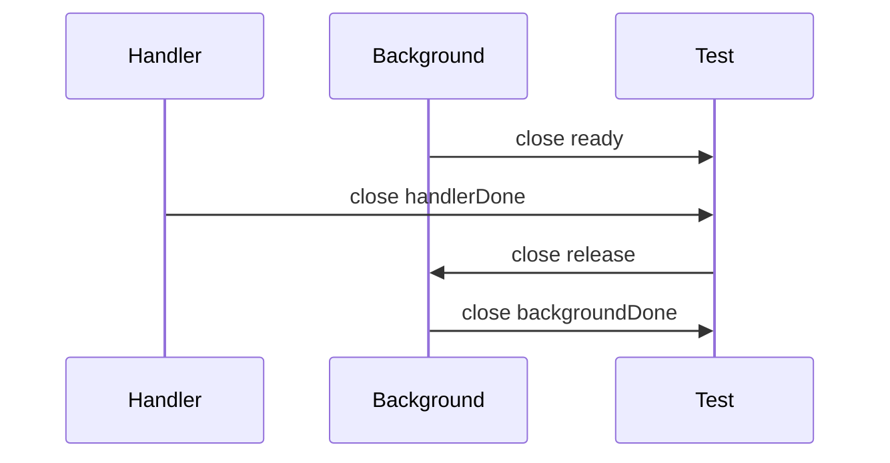

# 2026-07-31 学习文档：从测试证据到请求生命周期

> 对应训练：[`learning/training/2026-07-31.md`](../training/2026-07-31.md)
>
> 使用方式：先阅读不熟悉的章节，再完成对应题目。本文件讲知识与架构，不代替题目中的独立推理。

## 今日知识地图



## 1. 测试通过不等于程序已被证明

对应训练第 1 题。

测试回答的是：“这些输入在这次执行中产生了什么结果？”它不能自动回答：

- 所有合法输入是否都正确；
- 未执行的错误分支是否正确；
- 不同 goroutine 调度下是否仍正确；
- 时间复杂度是否满足要求；
- API 的所有权和生命周期契约是否合理。

这和 408 数据结构中的算法证明相似。几个样例是验证，循环不变量用于解释“为什么每一步都维持正确性”，复杂度分析则统计基本操作的总次数。

一个实用的证据层次是：

1. 最小样例验证主路径；
2. 边界用例验证特殊输入；
3. 反例验证容易出错的假设；
4. 不变量解释一般正确性；
5. race detector、benchmark 或 profile 提供并发与性能证据。

失败模式：把 `PASS` 理解成“没有 bug”。更准确的说法是“当前测试覆盖的执行路径没有观察到失败”。

## 2. slice 的三个量：指针、长度、容量

对应训练第 2 题。

slice 可以理解为一个很小的描述符：

```text
slice header = { pointer, len, cap }
```

- `pointer` 指向 backing array 中当前视图的起点；
- `len` 决定当前可以通过下标访问多少个元素；
- `cap` 决定从起点开始最多能扩展到多远。

赋值 `dst := src` 复制的是 slice header，不是数组元素，因此二者通常仍指向同一个 backing array。`make` 加 `copy` 则先创建新的元素存储，再复制元素。

### append 为什么有时共享、有时不共享

`append` 先判断现有容量是否容纳新增元素：

- 容量足够：可能复用原 backing array；
- 容量不足：分配新 backing array，并把旧元素复制过去。

因此“append 一定复制”与“append 一定共享”都不正确。判断时必须同时写出追加前的 `len` 和 `cap`。

三索引切片 `s[low:high:max]` 可以显式限制新 slice 的容量：

```go
limited := s[:0:0] // len=0, cap=0
```

向非空的 `limited` 追加元素时，现有容量为 0，因而必须获得新的元素存储。这常用于阻止被调用函数通过 append 意外覆盖调用方的数组。

### 空 slice 的特殊性

空 slice 没有第 0 个元素，所以 `s[0]` 必然越界。测试空输入时应断言长度和内容，而不能为了观察别名强行修改第一个元素。

最小验证：

```go
func TestEmptySlice(t *testing.T) {
    src := []int{}
    dst := append([]int(nil), src...)
    if len(dst) != 0 {
        t.Fatalf("len(dst)=%d, want 0", len(dst))
    }
}
```

面试追问：

- `nil` slice 与空但非 `nil` 的 slice 有什么区别？
- 函数接收 slice 后 append，会不会影响调用方？
- 如何返回一个不会与内部状态共享元素存储的快照？

## 3. 滑动窗口：状态、不变量与摊还分析

对应训练第 3 题。

滑动窗口适用于“连续区间”且左右边界能够单调前进的问题。最短包含至少 `k` 个不同值的窗口，需要维护：

- `left`、`right`：当前闭区间边界；
- `counts[x]`：值 `x` 在当前窗口中的出现次数；
- `distinct`：当前窗口中出现次数大于 0 的不同值数量。

核心不变量是：`counts` 和 `distinct` 必须始终准确描述当前窗口。加入右端元素时，频次从 0 变 1 才增加 `distinct`；删除左端元素时，频次从 1 变 0 才减少 `distinct`。

```text
右边界扩张：让窗口逐渐满足条件
左边界收缩：在条件仍满足时寻找更短答案
```

### 为什么嵌套循环仍可为 O(n)

不能只看到两层循环就判断 `O(n^2)`。`right` 只从左向右移动一次，`left` 也不会回退。两个指针各最多移动 `n` 次，总移动次数不超过 `2n`，所以 map 操作均摊为 `O(1)` 时，总时间为 `O(n)`。

这叫摊还分析，可以联系 408 中顺序表动态扩容：某一次操作可能昂贵，但把成本分摊到整段操作序列后仍是常数或线性级别。

失败模式：

- 频次减少到 0 时忘记减少 `distinct`；
- 条件满足后只收缩一次，错过更短窗口；
- 左指针回退或重新扫描窗口，使复杂度退化；
- 没有事先定义 `k <= 0` 或“不同值不足”的返回语义。

## 4. HTTP handler 的资源所有权

对应训练第 4 题。

`http.ResponseWriter` 属于当前请求的 handler 生命周期。最稳妥的契约是：只有 handler goroutine 写响应，并且所有写入都发生在 handler 返回前。

当前 `handlePostTask` 的结构可抽象为：



这里有三个边界问题：

1. handler 与后台 goroutine 都可能写响应，违反单一所有者原则；
2. handler 返回时没有等待后台工作，也没有把它交给服务级 worker；
3. 后台 DB 操作没有观察 `r.Context()`，客户端取消不能使其退出。

### context 只传播信号，不负责回收

`context.Context` 类似操作系统中的协作式取消：调用方发出取消信号，被调用方必须主动在阻塞操作或 `select` 中观察它。取消 context 不会强制终止 goroutine，也不会自动等待它结束。

需要逐一回答：

- goroutine 由谁创建和拥有？
- 哪个事件让它退出？
- 谁等待它结束？
- 阻塞点是否接收 context？
- 错误返回给谁？
- 下游变慢时如何背压？

### 请求级任务与服务级任务

- 请求级任务：结果决定本次 HTTP 响应，应在 handler 返回前完成，并使用 `r.Context()`。
- 服务级异步任务：允许请求结束后继续，应提交到有界队列，由服务级 worker 和服务生命周期 context 管理；不能继续持有 `ResponseWriter`。

失败模式：

- handler 返回后继续写响应；
- 两个 goroutine 写出冲突的状态码；
- 用 `time.Sleep` 测试并发顺序，导致测试偶发通过；
- 只运行 race detector，却没有让危险调度路径真实发生；
- 创建无界 goroutine，依赖变慢时造成资源耗尽。

## 5. 可控并发测试的架构

对应训练第 4 题。

并发测试应建立 happens-before 关系，而不是猜测调度器何时运行。channel 可以作为屏障：



- `ready`：证明后台已到达危险操作之前；
- `handlerDone`：证明 handler 已返回；
- `release`：由测试决定后台何时继续；
- `backgroundDone`：证明后台已退出。

测试替身还必须用 mutex 保护事件记录，否则测试代码自身可能产生数据竞争。超时只用于防止测试永久阻塞，不能用来排列正常执行顺序。

最小验证命令：

```powershell
go test ./目标包 -run TestHandlerLifecycle -count=100
go test -race ./目标包 -run TestHandlerLifecycle -count=100
```

`-count=100` 用于重复执行，但如果没有 channel 建立确定顺序，重复次数再多也不能替代正确的同步设计。

## 今日面试表达模板

可以用四句话回答这组知识：

1. 概念：测试样例提供有限路径证据，不变量解释一般正确性，复杂度由操作总次数证明。
2. Go 实现：slice 是否共享取决于 backing array；append 是否分配取决于容量。
3. 服务工程：`ResponseWriter` 应由 handler goroutine 独占，异步任务必须有明确的服务级所有者和取消边界。
4. 验证：边界使用表驱动测试，并发顺序使用 channel 屏障，race detector 作为补充证据而非业务正确性证明。
