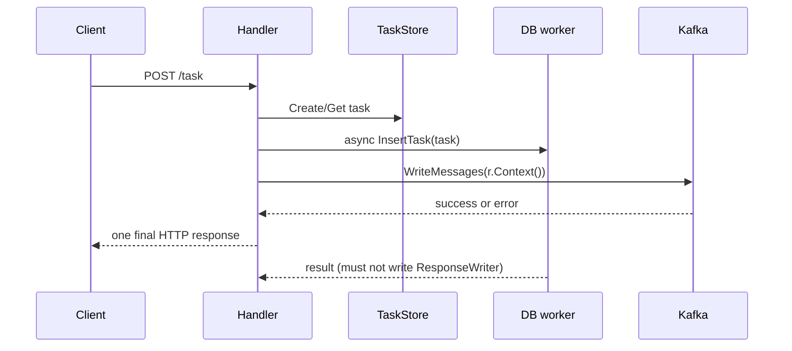

# 2026-08-01 Go 训练学习文档

> 对应训练文档：[`learning/training/2026-08-01.md`](../training/2026-08-01.md)
>
> 今天的目标不是扩展功能，而是把 HTTP handler 的生命周期、取消传播和可测试边界说清楚，并用一个小型算法证据题保持“定义—实现—验证”闭环。

## 1. 术语与前置知识

### 1.1 `ResponseWriter` 的所有权（对应题 2）

`http.ResponseWriter` 是一次 HTTP 请求的输出通道。handler 返回后，业务代码不应再持有并写入它。这里的“所有权”不是 Go 类型系统强制的权限，而是团队必须维护的契约：谁可以写状态码、header 和 body，谁负责在返回前完成写入。

这和 408 中的共享内存所有权类似：把指针传给另一个 goroutine 不会自动复制对象，也不会自动延长锁的保护范围。

### 1.2 请求 context 与服务 context（对应题 3）

`r.Context()` 通常代表客户端请求生命周期。客户端断开或 deadline 到期时，它会被取消；依赖调用必须显式接收并监听它。context 只传播取消信号和 deadline，不会自动终止任意 goroutine，也不会替调用方等待 goroutine 退出。

脱离请求继续执行的任务应由服务级 worker/队列拥有，并使用独立的服务生命周期 context。不能把请求的 `ResponseWriter` 或请求体偷偷交给后台任务。

### 1.3 可注入依赖与同步屏障（对应题 2）

要稳定测试并发时序，依赖必须能在“准备好”和“允许继续”两个点被控制。`ready`、`release`、`done` 是同步屏障；它们比 `time.Sleep` 更接近可证明的事件顺序。

## 2. 最小 Go 示例：取消传播

```go
func writeToQueue(ctx context.Context, q Queue, msg Message) error {
	select {
	case <-ctx.Done():
		return ctx.Err()
	default:
	}
	return q.Write(ctx, msg)
}
```

关键点是阻塞操作本身收到 `ctx`。只在函数入口检查一次，不能保证后续网络写入会在取消后停止。

## 3. 项目调用与数据流边界（对应题 2、3）

当前 `project/pkg/service.go` 的 `handlePostTask` 大致是：解析请求 -> `TaskStore.Create/Get` -> 后台 `DbService.InsertTask` -> 当前 goroutine 写 Kafka -> 后台 goroutine 写 HTTP 响应。最后两步造成两个执行流竞争同一个 `ResponseWriter`，而数据库插入也没有接收 `r.Context()`。



正确边界是：handler 独占 HTTP 响应；后台任务只回报结果、更新任务状态或写日志/指标。若任务必须异步执行，HTTP 响应应在入队成功后立即结束，任务失败通过状态查询或事件暴露。

## 4. 不变量、失败模式与取舍

### 4.1 不变量（对应题 2）

- 一个请求只有一个 goroutine 可以决定最终 HTTP 状态码。
- handler 返回前，所有对 `ResponseWriter` 的写入已经完成。
- 每个后台 goroutine 都有明确的退出条件、取消来源和等待责任。
- 需要跟随客户端取消的阻塞点都接收同一个请求 context。

### 4.2 常见失败模式

- handler 已返回，后台 goroutine 仍调用 `http.Error` 或 `Encode`。
- Kafka 失败路径写 `500`，后台 DB 成功路径又写 `202`，形成冲突响应。
- 用 `time.Sleep` 排序并发测试，导致偶发通过。
- 只在 race detector 无报告时宣布业务正确；race detector 不能证明状态码语义或错误传播正确。

### 4.3 工程取舍

最小修复可以让后台任务不再写 `ResponseWriter`，由 handler 在入队成功后返回 `202`。更完整的改造是抽出 `TaskRepository`、`Queue` 等消费者接口，使测试能控制阻塞和错误。接口应围绕当前消费者定义，避免为了 mock 制造大而全的抽象。

## 5. 面试追问与最小验证

- 追问：请求取消后，已经写入 Kafka 的消息能否撤回？答：通常不能，取消只影响尚未完成的调用；因此要讨论幂等键、任务状态和补偿，而不是假设 context 能回滚外部副作用。
- 追问：为什么 `go test -race` 通过仍可能有双写？答：race detector 关注内存访问竞争，不理解 HTTP 响应协议的“只能有一个最终状态”约束。
- 最小验证：先为 Queue/Repository 注入可控 fake，用 channel 固定 handler 返回与后台完成的先后，再断言 handler 返回后事件记录没有新增写入；随后运行 `gofmt`、目标包 `go test`，可用时再运行 `go test -race`。

## 6. 题目导航

- 题 1：用证据边界区分“样例通过”和“性质已证明”。
- 题 2：设计唯一响应所有者与可控同步屏障测试。
- 题 3：补写取消传播与异步任务契约的面试表达。
- 题 4：用一个短滑动窗口反例写不变量和复杂度证据。
